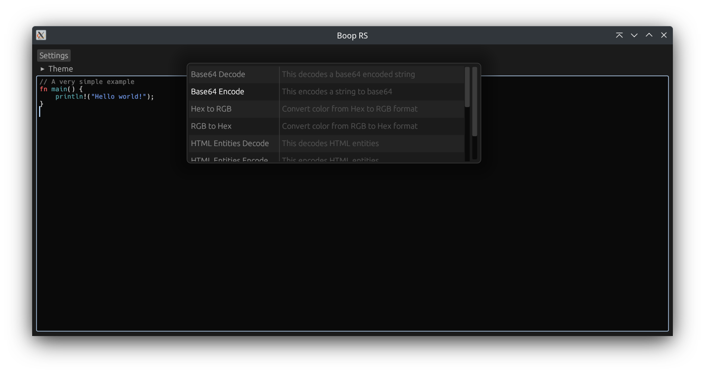

# Boop
This project is heavily inspired by the [Boop App](https://boop.okat.best/) for macOS by [Ivan Mathy](https://github.com/IvanMathy). But why should macOS users be the only ones to enjoy this wonderful piece of software? To make this wonderful app available to everyone I created a clone of the Boop App in Rust.

## Usage

Right now this project is focused mainly on the CLI part which allows you to quickly convert strings in the terminal like this:

```bash
$ curl -s https://dummy.restapiexample.com/api/v1/employee/1 | boop run json.format
{
  "status": "success",
  "data": {
    "id": 1,
    "employee_name": "Tiger Nixon",
    "employee_salary": 320800,
    "employee_age": 61,
    "profile_image": ""
  },
  "message": "Successfully! Record has been fetched."
}
```

Instead of piping the input to boop directly you can also use it like this

```bash
$ boop run base64.decode "SGVsbG8gV29ybGQh"
Hello World!
```

If you want to load your own plugins you can do so by providing the `plugins-folder` option like `-p, --plugins-folder <PLUGINS_FOLDER>` which will automatically recursively load all all plugins in that folder.

```bash
$ boop run -p "./plugins" general.remove_newlines $'\nHello,\n World!'
Hello World!
```

## Installation
Right now this project is not published anywhere so you'll need to clone this repository and build it yourself for now. The first official release date is not yet set.

If you just want to try out the project you can do so using the `cargo install` command.
```bash
cargo install --git https://github.com/A-K-O-R-A/boop-rs/ boop
```

The programm is shipped with some default plugins embedded into the executable and a loader for js plugins.

## Plugins & Loaders

### Default plugins
The `core` library exports some default plugins, by default these plugins are directly embedded into the application and are always available. These default plugins have the advantage of being blazingly fast so you can use them on huge files without problems.  


<details>
<summary><a href="https://crates.io/crates/base64">base64</a></summary>

 * base64.decode
 * base64.encode

</details>


<details>
<summary><a href="https://crates.io/crates/html-escape">html</a></summary>

 * html.decode
 * html.encode

</details>


<details>
<summary><a href="https://crates.io/crates/json">json</a></summary>

 * json.stringify
 * json.parse
 * json.format
 * json.minify

</details>


<details>
<summary>jwt</summary>

 * jwt.decode
 * jwt.format

</details>


<details>
<summary><a href="https://crates.io/crates/md5">md5</a></summary>

 * md5.hash
</details>


<details>
<summary>text</summary>

 * text.lowercase
 * text.uppercase
 * text.reverse
 * text.remove_newlines
 * text.count_chars
 * text.count_lines

</details>


<details>
<summary><a href="https://crates.io/crates/urlencoding">url</a></summary>

 * url.decode
 * url.encode

</details>

If you for some reason want to override these plugins you can turn of the individual features when compiling.

### Javascript
Of course external plugins are also supported. Right now there is only a loader for Javascript plugins implemented via the [`quick-js`](https://github.com/theduke/quickjs-rs) crate. You can easily write your own javascript plugins by just copying one of the examples in the `plugins` folder and changing the two functions.

The plugins need to have two functions `metadata(): Metadata` and `run(state: string): string`. When the plugins get loaded the `metadata()` function is executed once and its results get stored in memory. The `run` function get executed every time the plugin will be run with a single argument of the type `string`. Errors can be thrown by using the `throw` keyword (for example `throw "Invalid RGB notation"`).


### Other loaders
In the future it is planned to implement more loaders for languages like `lua`, but currently it is not the main focus of this project to implement a lot of diffrent loaders.

## GUI 


(Currently this the state of the GUI which, admittedly does not even look close to the orginal)

The original Boop App has a GUI instead of CLI so originally I wanted to recreate that, unfortunatly writing a GUI application in rust without any prior knowledge turned out to be harder than I thought. So for now this project is manly focused on the CLI part.